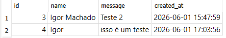
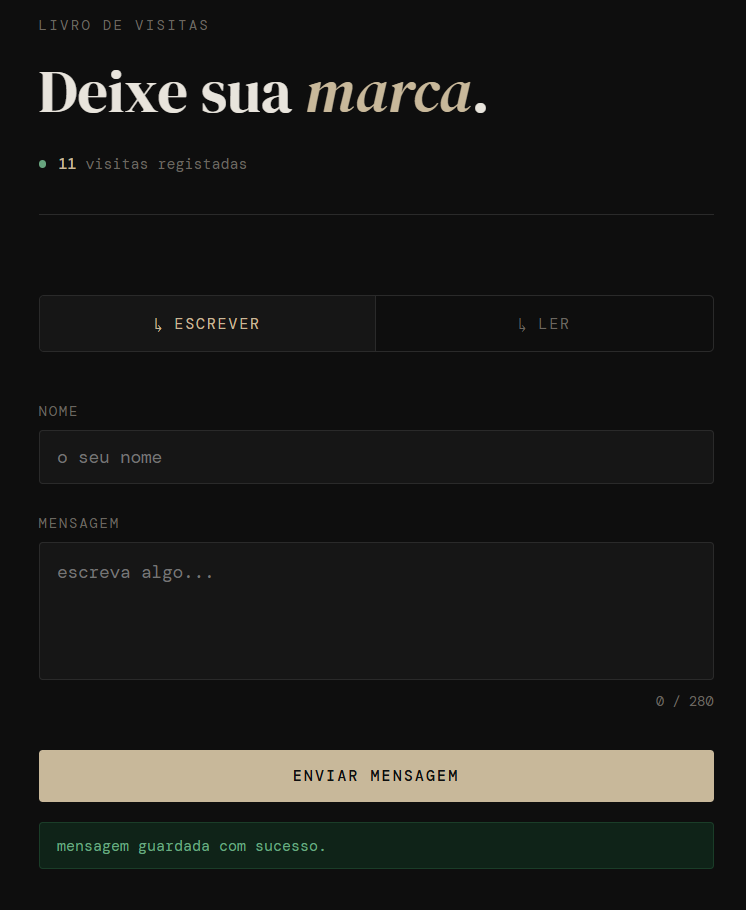
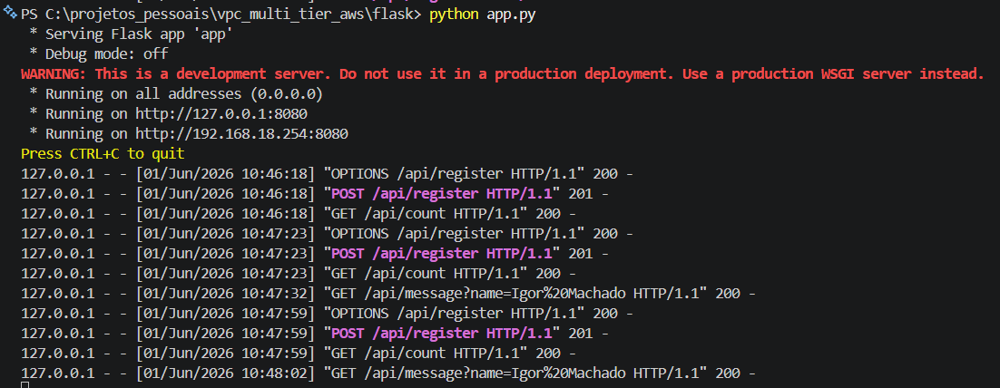

# Local Tests

Before proceeding with the cloud infrastructure deployment, the application was tested locally by running the `python app.py` command in the terminal to start the Flask server. In this setup, the local machine acted as the application server.

Some modifications were made to support local testing, including the use of SQLite as the database and changing the application port from 5000 to 8080. Both ports are commonly used for development and testing environments.

In a production environment, traffic is typically received through an Application Load Balancer (ALB) on port 443 using the HTTPS protocol. The ALB then forwards requests to an EC2 instance running the Flask application on port 8080.

After performing tests, the application was verified to function as expected.

  
  
  
  

  <em>Local application testing: database mockup, frontend validation, and Flask server execution.</em>

